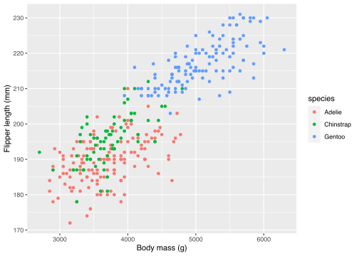
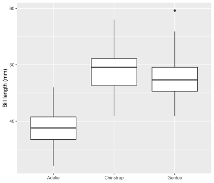
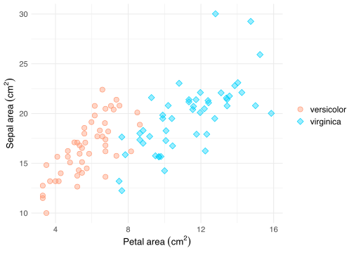

# Table of contents
- [Preamble](#preamble)
- [R basics](#r-basics)
  * [Data types](#data-types)
  * [Vectors](#vectors)
  * [Variables](#variables)
  * [Functions](#functions)
  * [Relational and logical operators](#relational-and-logical-operators)
  * [Comments](#comments)
- [Tidyverse](#tidyverse)
  * [Pipe operator](#pipe-operator)
  * [Manipulating data](#manipulating-data)
    + [mutate()](#mutate--)
    + [select()](#select--)
    + [drop_na()](#drop-na--)   
    + [filter()](#filter--)
    + [if_else() & case_when()](#if-else-----case-when--)
    + [distinct()](#distinct--)
    + [group_by()](#group-by--)
    + [summarize()](#summarize--)
  * [Importing data](#importing-data)
  * [Plotting data](#plotting-data)
- [Exercice](#exercice)
- [Further reading and tips](#to-go-further)

<a name="preamble" />

# Preamble
This is a brief and condensed guide to help you grasp the **fundamentals** of the **R language** and **tidyverse** as quick as possible.

After completing this module, you should be able to:

* know the different data types
* understand and use variables, vectors and functions
* know what the main logical operators are and how to use them
* use the basic tidyverse functions to import, transform and visualize your data

<a name="r-basics" />

# R basics
Before you start, install R and RStudio if you have not yet. I recommend using Rstudio for its user-friendly interface and useful additional functionalities.

Start RStudio and open a new script: `File` >` New File` > `R Script`. The **R script window** is what you will use to **write and save** your code. Write in your new script `"Welcome!"` and run the line using `Ctrl+Enter` (Windows/Linux) `Cmd+Return` (Mac). The output is displayed in the console window (by default, it is the bottom left window) and should be `[1] "Welcome!"`.

Just like other coding and programming languages, R is prone to syntax errors, e.g. typos, forgetting a quote, bracket or comma. Such mistakes will break your code and throw an error. Syntax errors are the most common type of error, so always double-check your code whenever R is unhappy. Finally, remember to **save your script regularly**.

Ok, now that you know the two most important RStudio windows, we can move on to the serious stuff.

<a name="data-types" />

## Data types
R treats all data as objects (think objects as nouns and adjectives). The most basic type of object in R is called a vector. E.g. `24` and `"hi"` are two different vectors of one element. Different vectors have different data types.

There are six data types in R. Here, we will focus on the four most common ones: `character`, `logical`, `double` and `integer`.
<table class="table table-striped" style="margin-left: auto; margin-right: auto;">
 <thead>
  <tr>
   <th style="text-align:left;"> value </th>
   <th style="text-align:left;"> type </th>
   <th style="text-align:left;"> abbrevation </th>
  </tr>
 </thead>
<tbody>
  <tr>
   <td style="text-align:left;"> -1, 0, 2.38 </td>
   <td style="text-align:left;"> double (decimal and whole numbers) </td>
   <td style="text-align:left;"> dbl </td>
  </tr>
  <tr>
   <td style="text-align:left;"> -1L, 0L, 2L </td>
   <td style="text-align:left;"> integer (whole numbers) </td>
   <td style="text-align:left;"> int </td>
  </tr>
  <tr>
   <td style="text-align:left;"> "Hello world!" </td>
   <td style="text-align:left;"> character (enclosed in double or single quotes) </td>
   <td style="text-align:left;"> chr </td>
  </tr>
  <tr>
   <td style="text-align:left;"> TRUE, FALSE </td>
   <td style="text-align:left;"> logical </td>
   <td style="text-align:left;"> lgl </td>
  </tr>
</tbody>
</table>

**Note:** `double` and `integer` types belong to the `numeric` class type.

You can perform mathematical operations on `numeric` and `logical` vectors but not on `character` vectors.

```r
1 + 1
## [1] 2

TRUE + TRUE
## [1] 2

"1" + "1"
## Error in "1" + "1": non-numeric argument to binary operator
```

<a name="vectors" />

## Vectors
You can combine several elements into a single vector using the `c()` [function](#functions). In this case, the vector is a sequence of **elements** of the **same type**.

```r
# double-precision vector
c(1, -2, 430.78)

# integer vector
c(1L, -2L, 430L)

# character vector
c("foo", "bar")

# logical vector
c(TRUE, FALSE, FALSE)
```

If you have elements of different types in a single vector, R will automatically convert each element to the same type.

```r
# despite having a single character element,
# the entire sequence is converted to the character type
c(1, 2, 3, "Hi", TRUE)
## [1] "1"    "2"    "3"    "Hi"   "TRUE"
```

<a name="variables" />

## Variables
Variables provide a storage space to R objects. You can store in an variable a vector, function, list, data frame, matrix, chunck of code... well pretty much anything, including another variable.

To assign a name to your object, use the assignment operator `<-` (keyboard shorcut: `Alt+-` (Windows & Linux) or	`Option+-` (Mac)).

```r
my_variable <- my_object
```
**Note:** the name of the variable can be a combination of `letters`, `digits`, `.` and `_`. You are free to give your variable the name you want as long as it **starts with** a `letter` or `.`. Choose a name that is both **concise** and **explicit**.

To print what is stored in a variable, simply call that variable.

```r
hello_wold <- "Hello world!"
hello_wold
## [1] "Hello world!"

x <- 2
x
## [1] 2

y <- 4
z <- x * y
z
## [1] 8
```
If two or more variables in the same environment share the same name, the variable that is called the last overwrites all the previous variables with the same name.

```r
a <- 3
b <- 4
a <- b
a
## [1] 4
```
**Note:** R is case sensitive. This means that lower and upper case letters are interpreted as different characters. E.g. `foo` is **not** the same as `Foo`.

<a name="functions" />

## Functions
A function is what you use to perform an action on your objects. Similarly to objects, which can be thought as nouns and adjectives, functions can be thought as verbs.

A function can have one, several or no arguments at all.

```r
# a function with multiple arguments
function_a(arg1, arg2)

# a function with no argument
function_b()
```
**Note:** most arguments are optional. Arguments are separated by a `,`.

Let's sum our previous `x` and `y` objects using the `sum()` function:

```r
sum(x, y)
## [1] 6
```
You can also create your own functions:

```r
# function to convert meters to feet
m_to_feet <- function(value) {
  value / .3048
}

m_to_feet(100)
## [1] 328.084
```
Values are assigned to argument names in the order they are defined. Writing the name of each argument is not mandatory but recommended to avoid any ambiguity or unwanted results.

Consider the example below:

```r
divide <- function(dividend, divisor) {
  dividend / divisor
}

divide(x, y)
## [1] 0.5

divide(y, x)
## [1] 2

divide(divisor = y, dividend = x)
## [1] 0.5
```

<a name="relational-and-logical-operators" />

## Relational and logical operators
You can use relational and logical operators to compare values and perform boolean operations. These operators yield a boolean value, that is either `TRUE` or `FALSE`.

Below is a list of R's most common relational and logical operators.
<table class="table table-striped" style="margin-left: auto; margin-right: auto;">
 <thead>
  <tr>
   <th style="text-align:left;"> operator </th>
   <th style="text-align:left;"> description </th>
  </tr>
 </thead>
<tbody>
  <tr>
   <td style="text-align:left;"> ! </td>
   <td style="text-align:left;"> not </td>
  </tr>
  <tr>
   <td style="text-align:left;"> == </td>
   <td style="text-align:left;"> equal to </td>
  </tr>
  <tr>
   <td style="text-align:left;"> != </td>
   <td style="text-align:left;"> not equal to </td>
  </tr>
  <tr>
   <td style="text-align:left;"> &lt; </td>
   <td style="text-align:left;"> less than </td>
  </tr>
  <tr>
   <td style="text-align:left;"> &gt; </td>
   <td style="text-align:left;"> greater than </td>
  </tr>
  <tr>
   <td style="text-align:left;"> &lt;= </td>
   <td style="text-align:left;"> less than or equal to </td>
  </tr>
  <tr>
   <td style="text-align:left;"> &gt;= </td>
   <td style="text-align:left;"> greater than or equal to </td>
  </tr>
  <tr>
   <td style="text-align:left;"> %in% </td>
   <td style="text-align:left;"> check if one or more elements exist in a vector </td>
  </tr>
  <tr>
   <td style="text-align:left;"> &amp; </td>
   <td style="text-align:left;"> and </td>
  </tr>
  <tr>
   <td style="text-align:left;"> | </td>
   <td style="text-align:left;"> or </td>
  </tr>
</tbody>
</table>
Here are some examples to illustrate how these operators work:

```r
"foo" == "foo"
## [1] TRUE

2 != 3.5
## [1] TRUE

4 < -2
## [1] FALSE

c("Hello", "Bye") %in% c("Hello", "world", "!")
## [1]  TRUE FALSE

!(2 %in% c(3, 6, 2))
## [1] FALSE

TRUE & FALSE
## [1] FALSE

TRUE | FALSE
## [1] TRUE
```

<a name="comments" />

## Comments
You can write comments in your script to add details and information to your code, or to stop a line from running. Comments are muted, that is they are not interpreted by the console.

To add a comment, simply insert a `#` before the statement you want to comment.

```r
# comments are not interpreted by the console
x <- 2
# x <- 4
x
## [1] 2
```

<a name="tidyverse" />

# Tidyverse
Tidyverse is a **collection** of **packages** specifically designed to import, manipulate, transform and visualize data. All the tidyverse packages incorporate a common phylosophy and grammar to form a **coherent framework** that facilitates the use of the tidyverse functions.

First off, install tidyverse. It might take a few minutes to download.

```r
install.packages("tidyverse")
```
When the download is complete, you can load the library with the following function:

```r
library(tidyverse)
```

<a name="pipe-operator" />

## Pipe operator
One of the key features of tidyverse is the possibility to chain functions in an effective way using the pipe operator ` %>% `. The pipe operator passes the object on its left to the function on its right (or the next line). It allows you to break down your code in small components connected to each other via a ` %>% `, making the code easy to read and write.

Consider the following examples*:

>`x %>% f` is equivalent to `f(x)`  
`x %>% f(y)` is equivalent to `f(x, y)`  
`x %>% f %>% g %>% h` is equivalent to `h(g(f(x)))`

` %>% ` can be read as `then`. E.g. `x %>% f() %>% g()` could be translated into words as: **object** *then* **do_sth** *then* **do_sth_else**.

**Note:** by default, ` %>% ` passes the object on the left to the **first argument** of the function on the right.

To pass the object to a different argument in a function, you can use the `.` placeholder as shown in the examples* below:

>`x %>% f(y, .)` is equivalent to `f(y, x)`  
`x %>% f(y, z = .)` is equivalent to `f(y, z = x)`

**Note:** the keyboard shorcut for `%>%` is `Ctrl+Shift+M` (Windows & Linux) or	`Cmd+Shift+M` (Mac).

*Examples taken from the [official documentation](https://magrittr.tidyverse.org).

<a name="manipulating-data" />

## Manipulating data
Here, you will learn some key functions from the tidyverse to handle data.

Let's make a small data frame to begin with. We will name our data frame (or tibble) `trees`:

```r
trees <- tibble(
  species = c("Larix decidua Mill.", "Fagus sylvatica L.", "Fagus sylvatica L.", "Larix decidua Mill.", "Larix decidua Mill.", "Fagus sylvatica L.", NA_character_, "Larix decidua Mill.", "Betula pendula Roth."),
  height = c(10, 17, 29, 7, 34, 22, 9, 6, 4),
  elevation = c(2900, 600, 600, 2900, 2300, NA_real_, 1100, NA_real_, 1700)
)
trees
# # A tibble: 9 x 3
#   species              height elevation
#   <chr>                 <dbl>     <dbl>
# 1 Larix decidua Mill.      10      2900
# 2 Fagus sylvatica L.       17       600
# 3 Fagus sylvatica L.       29       600
# 4 Larix decidua Mill.       7      2900
# 5 Larix decidua Mill.      34      2300
# 6 Fagus sylvatica L.       22        NA
# 7 <NA>                      9      1100
# 8 Larix decidua Mill.       6        NA
# 9 Betula pendula Roth.      4      1700
```

<a name="mutate--" />

### mutate()
The `mutate()` function adds or transforms an existing column.

Let's create a `location` column with the value `Alps`:

```r
trees <- trees %>% mutate(location = "Alps")
trees
# # A tibble: 9 x 4
#   species              height elevation location
#   <chr>                 <dbl>     <dbl> <chr>   
# 1 Larix decidua Mill.      10      2900 Alps    
# 2 Fagus sylvatica L.       17       600 Alps    
# 3 Fagus sylvatica L.       29       600 Alps    
# 4 Larix decidua Mill.       7      2900 Alps    
# 5 Larix decidua Mill.      34      2300 Alps    
# 6 Fagus sylvatica L.       22        NA Alps    
# 7 <NA>                      9      1100 Alps    
# 8 Larix decidua Mill.       6        NA Alps    
# 9 Betula pendula Roth.      4      1700 Alps
```
To edit an existing column, simply `mutate` the column you want to edit.

E.g. let's convert the elevation from meter to feet using the `m_to_feet()` function we previously made:

```r
trees %>% mutate(elevation = m_to_feet(elevation))
# # A tibble: 9 x 4
#   species              height elevation location
#   <chr>                 <dbl>     <dbl> <chr>   
# 1 Larix decidua Mill.      10     9514. Alps    
# 2 Fagus sylvatica L.       17     1969. Alps    
# 3 Fagus sylvatica L.       29     1969. Alps    
# 4 Larix decidua Mill.       7     9514. Alps    
# 5 Larix decidua Mill.      34     7546. Alps    
# 6 Fagus sylvatica L.       22       NA  Alps    
# 7 <NA>                      9     3609. Alps    
# 8 Larix decidua Mill.       6       NA  Alps    
# 9 Betula pendula Roth.      4     5577. Alps
```
You can apply this change to all the `dbl` columns at once using your own function inside `across()`:

```r
trees %>% 
  mutate(across(
    where(is.double),
    ~ .x / 0.3048
  ))
# # A tibble: 9 x 4
#   species              height elevation location
#   <chr>                 <dbl>     <dbl> <chr>   
# 1 Larix decidua Mill.    32.8     9514. Alps    
# 2 Fagus sylvatica L.     55.8     1969. Alps    
# 3 Fagus sylvatica L.     95.1     1969. Alps    
# 4 Larix decidua Mill.    23.0     9514. Alps    
# 5 Larix decidua Mill.   112.      7546. Alps    
# 6 Fagus sylvatica L.     72.2       NA  Alps    
# 7 <NA>                   29.5     3609. Alps    
# 8 Larix decidua Mill.    19.7       NA  Alps    
# 9 Betula pendula Roth.   13.1     5577. Alps
```
A word about what happens here:  
`~ .x / 0.3048` is an anonymous function. It is the shorthand for `function(x) {x / 0.3048}`. The placeholder `.x` refers to the subset of rows.

The code above targets all the columns of type `dbl` using the `where()` [helper](https://dplyr.tidyverse.org/reference/select.html) and applies our anonymous function to divide the values of the selected column by 0.3048.

You could of course use `m_to_feet()` instead:

```r
trees %>% 
  mutate(across(
    where(is.double),
    m_to_feet
  ))
```

<a name="select--" />

### select()
The `select()` function subsets columns by name, number and/or type.

Subsetting columns by name or number:

```r
select(col_name1, col_name2, col_name3)
# or
select(1, 2, 3)
```
To subset columns by type, you can use [helper functions](https://dplyr.tidyverse.org/reference/select.html):

```r
trees %>% select(where(is.character))
# # A tibble: 9 x 2
#   species              location
#   <chr>                <chr>   
# 1 Larix decidua Mill.  Alps    
# 2 Fagus sylvatica L.   Alps    
# 3 Fagus sylvatica L.   Alps    
# 4 Larix decidua Mill.  Alps    
# 5 Larix decidua Mill.  Alps    
# 6 Fagus sylvatica L.   Alps    
# 7 <NA>                 Alps    
# 8 Larix decidua Mill.  Alps    
# 9 Betula pendula Roth. Alps
```
Let's just remove the `location` column for now:

```r
trees <- trees %>% select(-location)
trees
# # A tibble: 9 x 3
#   species              height elevation
#   <chr>                 <dbl>     <dbl>
# 1 Larix decidua Mill.      10      2900
# 2 Fagus sylvatica L.       17       600
# 3 Fagus sylvatica L.       29       600
# 4 Larix decidua Mill.       7      2900
# 5 Larix decidua Mill.      34      2300
# 6 Fagus sylvatica L.       22        NA
# 7 <NA>                      9      1100
# 8 Larix decidua Mill.       6        NA
# 9 Betula pendula Roth.      4      1700
```

<a name="drop-na--" />

### drop_na()
The `drop_na()` function removes `NA` values in the entire data frame or specific columns.

Let's remove the row containing `NA` in the `species` column:

```r
trees <- trees %>% drop_na(species)
trees
# # A tibble: 8 x 3
#   species              height elevation
#   <chr>                 <dbl>     <dbl>
# 1 Larix decidua Mill.      10      2900
# 2 Fagus sylvatica L.       17       600
# 3 Fagus sylvatica L.       29       600
# 4 Larix decidua Mill.       7      2900
# 5 Larix decidua Mill.      34      2300
# 6 Fagus sylvatica L.       22        NA
# 7 Larix decidua Mill.       6        NA
# 8 Betula pendula Roth.      4      1700
```

<a name="filter--" />

### filter()
The `filter()` function subsets a data frame by keeping rows that satisfy one or more conditions.

Let's filter trees whose the height is higher than 25 m **or** species is *Betula pendula*:

```r
trees %>% filter(height > 25 | species == "Betula pendula Roth.")
# # A tibble: 3 x 3
#   species              height elevation
#   <chr>                 <dbl>     <dbl>
# 1 Fagus sylvatica L.       29       600
# 2 Larix decidua Mill.      34      2300
# 3 Betula pendula Roth.      4      1700
```

<a name="if-else-----case-when--" />

### if_else() & case_when()
The `if_else()` and `case_when()` functions allows you to replace column values with another based on one or more conditions.

The syntax of `if_else()` is as follows:

```r
if_else(condition, value_if_cond_TRUE, value_if_cond_FALSE)
```
E.g. let's replace the missing elevation of *Larix decidua*:

```r
trees %>% 
  mutate(elevation = if_else(
    is.na(elevation) & species == "Larix decidua Mill.", # to check if the elevation is NA and the species is Larix decidua
    2900, # to replace values that satisfy the condition by 2900
    elevation # to keep the original values when the condition is not satisfied
  ))
# # A tibble: 8 x 3
#   species              height elevation
#   <chr>                 <dbl>     <dbl>
# 1 Larix decidua Mill.      10      2900
# 2 Fagus sylvatica L.       17       600
# 3 Fagus sylvatica L.       29       600
# 4 Larix decidua Mill.       7      2900
# 5 Larix decidua Mill.      34      2300
# 6 Fagus sylvatica L.       22        NA
# 7 Larix decidua Mill.       6      2900
# 8 Betula pendula Roth.      4      1700
```
Use `case_when()` if you want to test more than one condition and edit values based on each condition. The syntax is a bit different than that of `if_else()` but not much complicated.

```r
case_when(
  condition1 ~ value_if_cond1_TRUE,
  condition2 ~ value_if_cond2_TRUE,
  conditionN ~ value_if_condN_TRUE,
  TRUE ~ value_if_above_conds_FALSE
)
```
Let's expand the previous example to the two species that have no elevation:

```r
trees <- trees %>% 
  mutate(elevation = case_when(
    is.na(elevation) & species == "Larix decidua Mill." ~ 2900,
    is.na(elevation) & species == "Fagus sylvatica L." ~ 600,
    TRUE ~ elevation # to keep the original values when the conditions above are not satisfied
  ))
trees
# # A tibble: 8 x 3
#   species              height elevation
#   <chr>                 <dbl>     <dbl>
# 1 Larix decidua Mill.      10      2900
# 2 Fagus sylvatica L.       17       600
# 3 Fagus sylvatica L.       29       600
# 4 Larix decidua Mill.       7      2900
# 5 Larix decidua Mill.      34      2300
# 6 Fagus sylvatica L.       22       600
# 7 Larix decidua Mill.       6      2900
# 8 Betula pendula Roth.      4      1700
```

<a name="distinct--" />

### distinct()
The `distinct()` function subsets unique rows from a data frame.

Subsetting unique species:

```r
trees %>% distinct(species, .keep_all = TRUE) # use .keep_all = TRUE to retain all the columns
# # A tibble: 3 x 3
#   species              height elevation
#   <chr>                 <dbl>     <dbl>
# 1 Larix decidua Mill.      10      2900
# 2 Fagus sylvatica L.       17       600
# 3 Betula pendula Roth.      4      1700
```

<a name="group-by--" />

### group_by()
The `group_by()` function groups your data by one or more variables. This is useful when you want to perform operations on clusters of data rather than the whole dataset.

Let's calculate the mean height by species:

```r
trees %>% 
  group_by(species) %>% 
  mutate(height_mean = mean(height)) %>% 
  ungroup()
# # A tibble: 8 x 4
#   species              height elevation height_mean
#   <chr>                 <dbl>     <dbl>       <dbl>
# 1 Larix decidua Mill.      10      2900        14.2
# 2 Fagus sylvatica L.       17       600        22.7
# 3 Fagus sylvatica L.       29       600        22.7
# 4 Larix decidua Mill.       7      2900        14.2
# 5 Larix decidua Mill.      34      2300        14.2
# 6 Fagus sylvatica L.       22       600        22.7
# 7 Larix decidua Mill.       6      2900        14.2
# 8 Betula pendula Roth.      4      1700         4
```
**Note:** ungrouping ensures that future operations will not only apply to the grouping variables previously set.

<a name="summarize--" />

### summarize()
The `summarize()` (or `summarise()`) function summarizes and reduces the dimensions of your data frame by grouping variables.

E.g. summarising the `trees` data frame by `species`, `elevation` and `height_mean`:

```r
trees %>% 
  group_by(species, elevation) %>% 
  summarize(height_mean = mean(height)) %>% 
  ungroup()
# # A tibble: 4 x 3
#   species              elevation height_mean
#   <chr>                    <dbl>       <dbl>
# 1 Betula pendula Roth.      1700        4   
# 2 Fagus sylvatica L.         600       22.7 
# 3 Larix decidua Mill.       2300       34   
# 4 Larix decidua Mill.       2900        7.67
```
The code above is the equivalent to:

```r
trees %>% 
  group_by(species, elevation) %>% 
  mutate(height_mean = mean(height)) %>% 
  ungroup() %>% 
  distinct(species, elevation, height_mean) %>% 
  arrange(species, elevation) # to sort rows by species and elevation in ascending order
```

<a name="importing-data--" />

## Importing data
You can import `.csv` files using the `read_` [function family](https://readr.tidyverse.org/reference/read_delim.html). There are different functions for different separators.

E.g. to read a comma-separated values file:

```r
"path_to_file/data.csv" %>% read_csv()
# or
read_csv("path_to_file/data.csv")
```
Be sure to use the appropriate `read_` function for your file. Alternatively, you can use the more general `read_delim()` function and specify your separator manually in the `delim` argument.

```r
read_delim("path_to_file/data.csv", delim = "\t") # to read tab separated values
```

<a name="plotting-data--" />

## Plotting data
You can plot graphs using the ggplot2 package (part of the tidyverse).

**Note:** `ggplot` functions are chained using a `+` sign. This is because `ggplot` does not pass an object to a function but add different layers on top of each other.

We will use the `iris` dataset in this example. It is a built-in dataset of floral data of three *Iris* species, namely *Iris setosa*, *Iris versicolor* and *Iris virginica*.

```r
iris
# # A tibble: 150 x 5
#    Sepal.Length Sepal.Width Petal.Length Petal.Width Species
#           <dbl>       <dbl>        <dbl>       <dbl> <fct>  
#  1          5.1         3.5          1.4         0.2 setosa 
#  2          4.9         3            1.4         0.2 setosa 
#  3          4.7         3.2          1.3         0.2 setosa 
#  4          4.6         3.1          1.5         0.2 setosa 
#  5          5           3.6          1.4         0.2 setosa 
#  6          5.4         3.9          1.7         0.4 setosa 
#  7          4.6         3.4          1.4         0.3 setosa 
#  8          5           3.4          1.5         0.2 setosa 
#  9          4.4         2.9          1.4         0.2 setosa 
# 10          4.9         3.1          1.5         0.1 setosa 
# # … with 140 more rows
```
Assuming you want to see if there is a relationship between petal width and petal length for each species. You can visualize such relationship by plotting the petal width against the petal length in a scatter plot:

```r
iris %>% 
  ggplot(aes(
    x = Petal.Length,
    y = Petal.Width,
    color = Species # to assign a color to each group
  )) +
  geom_point() + # to plot a scatter plot
  labs(
    x = "Petal length (cm)",
    y = "Petal width (cm)"
  )
```

<!-- -->

If you want to compare the sepal length of each species, you can do so by plotting a boxplot:

```r
iris %>% 
  ggplot(aes(
    x = Species,
    y = Sepal.Length
  )) +
  geom_boxplot() + # to plot a boxplot
  labs(
    x = NULL, # to remove the label of the x axis
    y = "Sepal length (cm)"
  )
```

<!-- -->

`ggplot` offers many plotting possibilities. You can learn more [here](https://ggplot2-book.org).

<a name="exercice--" />

# Exercice
Using the `iris` dataset, look at the relationship between sepal area and petal area in *Iris versicolor* and *Iris virginica*.

In two new columns, compute the petal and sepal area for each individual. Plot the sepal area against the petal area by species group using `ggplot()` and `geom_point()`.

For the purpose of this exercice, we will make the assumption that the petal and sepal width does not change along the petal and sepal length.

This time, we will change the default settings to make the scatter plot look prettier.

Copy-paste the code below in a new R script. Replace the `# insert your code here` comment with your own code.

Add in the `aes()` function (inside `ggplot()`) the argument `shape = Species` and `fill = Species` to assign a shape and fill color to your groups, respectively. Finally, add the argument `size = 3` inside `geom_point()`.

```r
iris_colors <- c("#FF9671", "#00D2FC")
# insert your code here
# do not forget to link your code and the lines below with a '+'
  scale_color_manual(values = iris_colors) + # to change the colors of the points
  scale_shape_manual(values = c(21, 23)) + # to change the shape of the points
  scale_fill_manual(values = alpha(iris_colors, .4)) + # to add the fill colors and transparency
  labs(
    x = expression(Petal~area~(cm^{2})),
    y = expression(Sepal~area~(cm^{2}))
  ) +
  theme_minimal() + # to change the general theme of the plot
  theme(legend.title = element_blank())
```
Here is the output you are supposed to get:

<!-- -->

If you ended up with the same plot, congratulations! Do not hesitate to try to add the third species in the graph and to play around with the different colors and shapes.

If you got a different graph, try a bit more. Do not hesitate to go back and read the different sections again. All the information needed to make the plot is in this page. If you have an error, check that you used a proper chaining sign and did not forget a comma or bracket.

<a name="further-reading--" />

# Further reading and tips
Here are some recommendations if you want to expand your knowledge and skills in R:

* [BioStats](https://biostats.w.uib.no)
* [Rstudio Cloud](https://rstudio.cloud/learn/primers) (video tutorials)
* [Official tidyverse website](https://www.tidyverse.org)
* [R for Data Science](https://r4ds.had.co.nz/index.html)
* [ggplot2: Elegant Graphics for Data Analysis](https://ggplot2-book.org)
* [Fundamentals of Data Visualization](https://serialmentor.com/dataviz/)

Tips:
* [Code completion](https://support.rstudio.com/hc/en-us/articles/205273297-Code-Completion)
* [Data viewer](https://support.rstudio.com/hc/en-us/articles/205175388-Using-the-Data-Viewer)
